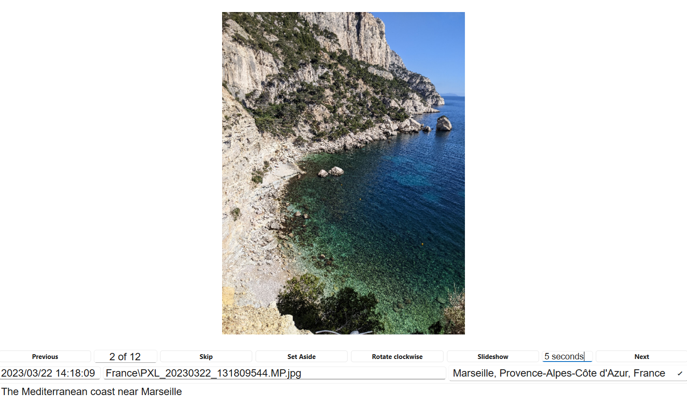
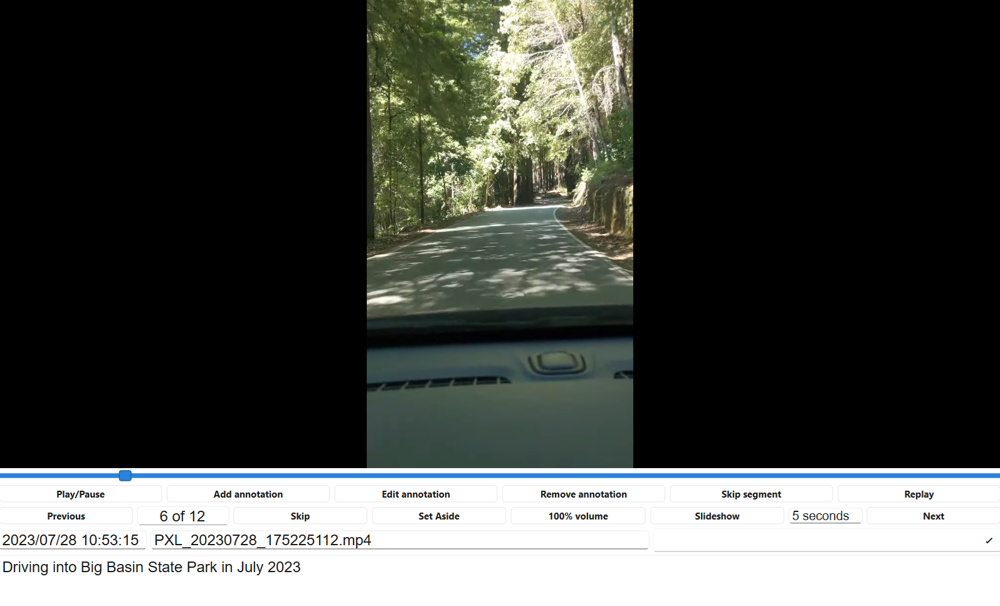

<nav>
  <a href="#walkthrough-video">Video</a> |
  <a href="#features">Features</a> |
  <a href="#download">Download</a> |
  <a href="#usage">Usage</a> |
  <a href="https://github.com/clzirbel/pva_photo_video_annotator">GitHub</a>
</nav>

---



---

# Walkthrough video <a id="walkthrough-video"></a>

<video controls
       style="max-width: 900px; width: 100%;
              border: 1px solid #333;
              box-sizing: border-box;">
  <source src="assets/PVA_walkthrough.mp4" type="video/mp4">
</video>

---

# Features <a id="features"></a>

- **Browse Media**: View photos and videos from any folder with a clean, intuitive interface
- **Subfolder Support**: When opening a folder, you'll be prompted for each subfolder to choose to include or exclude the files from each one
- **Organize Media**: Quickly hide unwanted files or move them to a "Set Aside" folder
- **Image Annotations**: Add text descriptions to photos
- **Video Annotations**: Add time-stamped text annotations throughout videos
- **Skip Video Segments**: Mark parts of videos to be automatically skipped during playback
- **Location Tagging**: Automatically extract GPS coordinates from photos and reverse-geocode them to city/state/country, or add locations manually by typing them or by choosing from a dropdown of values from the folder
- **Volume Control**: Adjust video volume on a per-file basis
- **Image Rotation**: Rotate photos that have incorrect orientation
- **Persistent Storage**: All annotations and metadata are saved to a text file in JSON format, using minimal disk space
- **Your files**:  Your media files are not altered or deleted.

---

# Download and Install Executable Files <a id="download"></a>

The easiest way to use PVA is to use the download link below to get the file(s) necessary for your operating system.

**[Go to the latest release]({{ site.github.latest_release.html_url }})**

## Windows

Download:
- `PVA_Photo_and_Video_Annotator_Windows.exe`

Notes:
- If Windows warns that the program is unsafe, click **More info → Run anyway**
- After that, you can right-click an image file, choose **Open with…**, and select the PVA executable to be used once or always

---

## macOS

Download **both**:
- `PVA_Photo_and_Video_Annotator_macOS`
- `run_PVA_macOS.command`

On the first run:
1. Save both files in the same folder
2. Double-click `run_PVA_macOS.command` to set permissions
3. The script will prepare and launch the app

After that, you can launch `PVA_Photo_and_Video_Annotator_macOS` directly

---

## Linux

Download:
- `PVA_Photo_and_Video_Annotator_Linux`

Make executable if needed:
```bash
chmod +x PVA_Photo_and_Video_Annotator_Linux
```

---

# Preparation <a id="preparation"></a>

## File organization

Your folder of images and videos can have subfolders with additional images and videos; the program will first ask you which sub-folders to consider. Generally, it is good to use the program on a folder with a single coherent theme, rather than on multiple loosely related folders.

When you launch the application, select the folder containing your photos and videos. You'll be prompted to confirm which subfolders to include in your annotation project. The program will read any existing annotations from an `annotations.json` file in that folder, or create one if it doesn't exist.

You can manually remove files from the folder, PVA will not complain that they are gone.
If you rename a file, PVA will not associate the new name with information stored for the old name.

## Supported Image and Video Formats

**Images**: JPG, JPEG, PNG, GIF, BMP, TIFF, TIF, WebP

**Videos**: MP4, MOV, AVI, MKV, FLV, WMV, WebM, M4V, 3GP

---

# Navigation



## Sort Order

Files are sorted by creation date, which is determined intelligently:
  - For photos: EXIF datetime is used (the actual date the photo was taken)
  - For files without EXIF data: The earliest filesystem timestamp is used (handles Google Photos and other downloaded files correctly)
  - You can manually edit any creation date by clicking on the date field and entering a new date in `YYYY-MM-DD HH:MM:SS` format
  - Manually editing the creation date is useful, for example, if you splice in a downloaded stock image to be part of the slideshow.
  - No other sorting criterion is supported at this time.

## Next and Previous Buttons

- **Next**: Moves to the next media file in the folder. If you're at the last file, it wraps back to the first.
- **Previous**: Moves to the previous media file. If you're at the first file, it wraps back to the last.
- **Filename Display**: The filename is shown with its relative path, so files in subfolders appear as `SubfolderName/filename.jpg`

## Skip File

Click the **Skip** button to hide a media file from view. The file is marked as skipped in the annotations and will be automatically passed over when navigating forward or backward.

- The file is not deleted or moved
- The skip information is stored in `annotations.json` with `"skip": true`
- Both Next and Previous buttons will skip over these files
- Use this for files you want to ignore without deleting or moving them

## Set Aside File

Click the **Set Aside** button to move a file to a `set_aside` subfolder.
This is like deleting a file, but not as severe.

- The file is moved to a `set_aside` folder in the same directory where the file is located
- For files in the main directory: moved to `main_directory/set_aside/`
- For files in subfolders: moved to `subfolder/set_aside/` (this keeps files organized by their original location)
- The file is physically moved (not just marked as skipped)
- You can recover files by moving them back out of the set_aside folder manually
- Use this when you're sure you don't want a file and you may want to delete all of the files in the set_aside folder to save space

## Slideshow

Click the **Slideshow** button to automatically cycle through your media files:

- **Images**: Each image displays for the configured amount of time (default: 5 seconds), or longer if you've added text annotations (annotation text length is factored in)
- **Videos**: Each video plays to completion before automatically advancing to the next file
- **Stop Slideshow**: Click the button again to stop the slideshow at any time
- **Adjust Timing**: Use the editable text field next to the Slideshow button to change how many seconds each image displays. Type a new number (e.g., "10 seconds") and press Enter. The setting is saved and will be used for all future slideshows.
- **Quick View**: Use a delay time of 1 second or less to have PVA quickly advance through images and videos; this can help you understand the organization.

# Image annotation and display modifications

## Image Annotations

For images, you can add and edit a text description:

1. Click in the text box at the bottom of the screen
2. Type your annotation (e.g., "Family picnic in the park" or technical details about the photo)
3. Click elsewhere indicate that you are done editing

The text is automatically saved to the JSON file under the `text` field for that image.

## Rotate Image

Click the **Rotate** button (only available for images) to rotate a photo clockwise:

- First click: 90° rotation
- Second click: 180° rotation
- Third click: 270° rotation
- Fourth click: Returns to 0° (original orientation)

The rotation preference is saved for the image in the JSON file and will be remembered the next time you view it.

## Location Information

The application automatically extracts GPS coordinates from photo metadata using EXIF data. When coordinates are found, it performs a reverse geocoding lookup using OpenStreetMap's Nominatim service to determine the city, state, and country.

### Automatic Location Detection

When you view a photo with GPS data:

1. The application extracts latitude and longitude from the photo's EXIF metadata
2. It automatically looks up the address
3. The location is stored as `location.automated_text` in the JSON file
4. The location appears in the location dropdown

### Manual Location Entry

You can also manually set or override the location:

1. Click on the location dropdown on the right side of the screen
2. Either type a new location or select a previously used location from the list
3. The location is saved as `location.manual_text` in the JSON file
4. If both manual and automated locations exist, the manual location is displayed

The dropdown shows all unique locations (both manual and automated) across all files in your collection, making it easy to maintain consistency.

# Video Display and Annotations



## Playing Videos

When you navigate to a video:

1. The video begins playing automatically
2. The volume is set to whatever you previously selected (or 100% if newly displayed)
3. Use **Play/Pause** to control playback
4. Use **Replay** to restart from the beginning
5. Click on the progress slider to jump to a specific time, or hover over it to see timestamps

## Add Video Annotation

Videos support more sophisticated annotation: you can add multiple text annotations at different time points, and mark segments to be automatically skipped.

To add a text annotation at a specific time:

1. Pause the video at the desired time point
2. Click **Add annotation**
3. Type your text (e.g., "Golden retriever enters the scene")
4. Click elsewhere or press tab to save
5. The annotation is saved with the current video timestamp

You can add as many annotations as you want throughout the video, each with its own timestamp.

## Edit Video Annotation

To edit an existing annotation:

1. Pause the video at any time within an annotated segment (the annotation text will appear in the text box)
2. Click **Edit annotation**
3. Modify the text
4. Click elsewhere to save

The text is updated while the timestamp remains unchanged.

### Skipping Video Segment

To mark a segment of the video to be automatically skipped during playback:

1. Pause the video at the point where you want skipping to begin
2. Click **Skip until next annotation**
3. The video marks this point and jumps to the next annotation (or end of video)
4. During playback, when this skip point is reached, the video automatically jumps to the next annotation
5. There is no particular limit to the number of segments that can be skipped

This is useful for removing unwanted sections (background noise, false starts, etc.) without deleting the original video file.  You can adjust the slider into a skipped segment to remove the skip annotation, if desired, or to start a new annotation where the video should start playing again.

## Removing Video Annotation

To delete an annotation:

1. Pause the video during the time of the annotation you want to remove
2. Click **Remove annotation**
3. The annotation is deleted and the video returns to the previous annotation

## Video Volume Control

For videos, use the **Volume** button (showing the current volume level) to adjust playback volume:

- Click to cycle through: 100% → 80% → 60% → 40% → 20% → 0% → back to 100%
- The volume preference is saved per video file
- When you return to a video, it plays at the previously saved volume level

Use this to mute videos with too much background noise or to reduce or equalize volume for quieter content.

# Storage and Formats

All annotations, metadata, and preferences are stored in a JSON file (`annotations.json`) in your media folder. The JSON format makes it easy to:

- Back up your annotations
- Share annotations with others
- Edit annotations manually if needed
- Use the annotations with other tools

However, be careful with JSON format because the brackets and commas are very important; it is better to avoid editing the JSON file if at all possible.

# Date and Time Handling

The application intelligently determines creation dates for your media files:

- **EXIF DateTime Priority**: For photos with EXIF metadata, the `DateTimeOriginal` tag is used. This is the most accurate representation of when the photo was actually taken.
- **Filesystem Timestamp Fallback**: For files without EXIF data or videos, the earliest available filesystem timestamp is used (choosing between creation time, modification time, or birth time). This ensures proper sorting even for downloaded files from Google Photos or other sources.
- **Manual Override**: You can manually edit any file's creation date by clicking the date field and entering a new date in `YYYY-MM-DD HH:MM:SS` format. This override takes precedence over all automatic detection.
- **Storage**: Automatic dates are cached in the JSON for performance. Manual dates are stored separately and always used when available.

The goal is that files are always sorted in the order they were taken, regardless of whether they were downloaded, emailed, or copied to your collection.

# JSON File Entries

The file annotations.json stores the text you type and the location information that PVA extracts and looks up online.

Each media file gets an entry in the JSON with:
- `text`: Text annotation (images) or time-stamped annotations (videos)
- `skip`: Whether the file should be skipped (images) or skip points (videos)
- `rotation`: Image rotation in degrees (0, 90, 180, or 270) - only stored if non-zero
- `volume`: Video volume level (0-100) - only stored if not 100%
- `location`: GPS coordinates and location information
- `annotations`: Array of time-stamped annotations (videos)

The application also stores settings in the `_settings` object:
- `image_time`: Number of seconds each image displays during slideshow (default: 5)
- `font_size`: Font size for text (default: 14)

# Tips and Tricks

- **Keyboard Navigation**: Use the arrow keys (→ and ←) to navigate between files quickly
- **Slideshow for Review**: Use Slideshow mode to review or admire your entire collection at once
- **Location Dropdowns**: The location dropdown shows all previously used locations, making it easy to tag files consistently
- **Timestamps**: Hover over the video progress bar to see the exact timestamp at any point
- **Volume Adjustments**: You can change volume while a video is playing; the change applies immediately

---

# Source Code

[View on GitHub]({{ site.github.repository_url }})